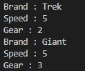
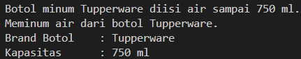
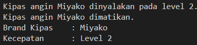
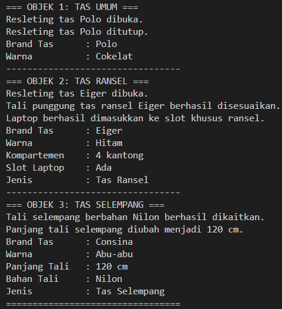
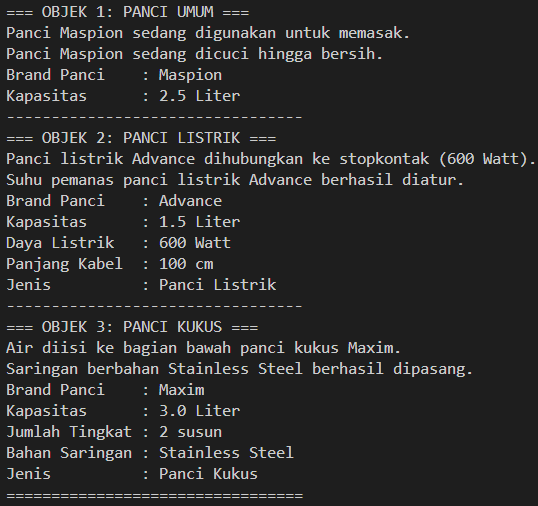

|  | Pemrograman Berbasis Web |
|--|--|
| NIM |  254107020229|
| Nama | Nurfakiyah Rahmadhani |
| Kelas | TI - 2G |
| Repository | [https://github.com/borzooraa/PemrogramanBerbasisObjek] |

#LAPORAN #1 PENGANTAR KONSPE PEMROGRAMAN BERBASIS OBJEK

## 3.1 Percobaan 1
Hasil dari percobaan ini dapat dilihat pada gambar di bawah ini:

Pada program tersebut kita menentukan speed, gear, dan juga  brand. Ada hal yang saya notice pada hasil running program tersebut, yaitu hasil speedAcceleratinnya tetap 5 meskipun gear dan speednya berubah. Hal ini bisa terjadi dikarenakan pada file bikeDemo.java melakukan pemanggilan speedAcceleration terlebih dahulu sebelum gearChanges, dimana hal tersebut menyebabkan nilai gear akan tetap menajdi 1, dikarenakan nilai defalt dari gear adalah 1. 

## 3.2 Percobaan 2
Hasil percobaan ini dapat dilihat pada gambar di bawah ini:

Pada program ini, kita menambahkan child dari class bike yaitu roadBike. Karna roadBike merupakan child dari bike maka kita tidak perlu menambahkan fungsi gear, speed, dan brand. Pada class tersebut kita hanya perlu menambahkan atribut tambahan berupa tireWidth. Selain itu speednya juga bernilai 5, dengan alasan yang sama seperti pada percobaan 1.

## 4. Kesimpulan
Pada kedua percobaan di atas menjelaskan mengenai konsep OOP, dan juga salah satu fitur OOP yaitu inherintence. Pada dasarnya Bike merupakan parent dari roadBike. Karna roadBike merupakan child dari bike, maka tidak perlu membuat class roadbike dari nol. Kita hanya perlu menambahkan atribut khusus saja. Karena atribut bawaan dari parent (disini contohnya brand, gear, dan speed) akan di extend (diwariskan) kepada child (roadBike)

## 5. Pertanyaan
1. Perbedaan antara  class dan object yaitu, simpelnya class merupakah sebuah blueprint tempat untuk mendefinisikan struktur data dan perilaku umum, sementara object adalah hasil wujud nyata dari blueprint itu tadi, dimana object memuat data spesifik dan aktif di memori saat program berjalan. Dalam contoh percobaan tadi, contoh class terdapat di file bike.java dan juga roadBike.java, kemudian untuk objectnya yaitu mountiainBike1, mountainBike2 dll. Satu hal lain yang mencirikan suatu objek adalah, objek memiliki "kebiasaan" yang dimana fungsinya biasanya menggunakan kata kerja serta atribut, dan juga biasanya di tandai dengan kata kunci new saat instansiasi.
2. Gear dan brand merupakan atribut dari object Bike dikarenakan gear dan brand itu merupakan state(ciri-ciri) dari bike tersebut. Dimana ciri-ciri tersebut juga bisa melakukan kebiasaan dan ada fungsi dengan kata kerja.
3. Satu kelebihan utama OOP dibanding procedular adalah OOP memungkinkan perubahan fitur tidak akan mengganggu keseluruhan program. Lebih jelasnya jika ada satu bagian yang rusak, kerusakan tersebut tidak langsung berpengaruh ke bagian lain.
4. Boleh selama tipe datanya sama. Hal itu tidak akan membuat program menjadi error.
5. Hal ini dikarenakan roadBike merupakan child dari bike, dimana atribut brand, speed, dan gear merupakan atribut bawaan dari parent (bike).

## 6. Tugas Praktikum 
Object yang akan saya gunakan antara lain adalah
1. Botol Minum

gambar

2. Kipas Angin

gambar

3. Tas (inherintance)

gambar

4. Panci (inheritance)

gambar

dengan hasil running program seperti di bawah ini:
1. Botol Minum

2. Kipas Angin

3. Tas

4. Panci

