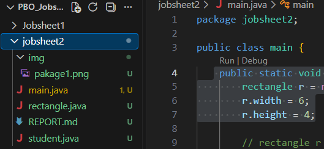
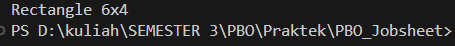
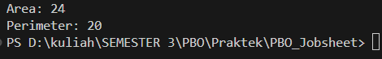
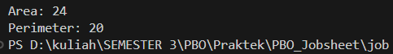
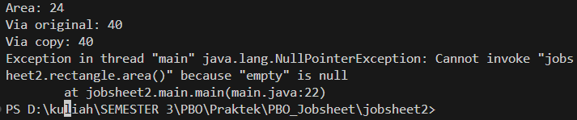
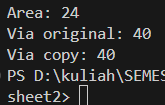
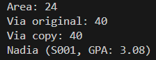
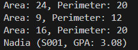
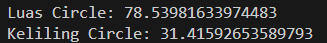

|  | Pemrograman Berbasis Web |
|--|--|
| NIM |  254107020229|
| Nama | Nurfakiyah Rahmadhani |
| Kelas | TI - 2G |
| Repository | [https://github.com/borzooraa/PemrogramanBerbasisObjek] |

# JOBSHEET 2 #KELAS DAN OBJEK

## Checkpoint 1 

Nama pakage tidak sama dengan yang ada di jobsheet dikarenakan saya memberikan nama pakagenya sesuai jobsheet berapa yang saya kerjakan sekarang agar memudahkan saya untuk melihat dokumentasi hasil kerja saya.

## Checkpoint 2

Hasil running sama persis dengan di jobsheet dan tidak ada error ketika menjalankan.

## Checkpoint 3

Hasil yang sama seperti pada jobsheet.

## Checkpoint 4

hasil yang sama seperti checkpoint 3 dengan sintaks yang lebih pendek

## Checkpoint 5

dari sintaks yang dijalankan menghasilkan java.lung.NullPointerExeption. Namun jika dua baris paling bawah di hilangkan maka program akan berjalan lancar dan menghasilkan

NullPointerExeption selalu muncul jika ada method pada referensi yang belum menunjuk  ke objek manapun (null). Cara agar tidak terjadi error tersebut yaitu selalu memastikan objek benar-benar dubuat dengan new sebelum methodnya dipanggil.

## Checkpoint 6

Program berhasil menampilkan baris terakhir sesuai jobsheet.

## Checkpoint 7

terdappat 3 baris yang menampilkan area dan perimater masing-masing rectangle, kemudian di baris terakhir menmpilkan baris Nadia

## TUGAS DAN DERIVALABLE
1. Running

2. Jawaban
- Objek adalah data/instance nyata yang dialokasikan di memori heap saat menggunakan perintah new. Sedangkan referensi ke objek adalah variabel pemegang alamat memori yang menunjuk ke lokasi objek tersebut berada.
- Konstruktor dijalankan secara otomatis satu kali tepat saat objek baru diciptakan menggunakan kata kunci new. Proses ini berfungsi untuk mengalokasikan memori dan menginisialisasi nilai awal dari atribut kelas tersebut.

