|  | Pemrograman Berbasis Web |
|--|--|
| NIM |  254107020229|
| Nama | Nurfakiyah Rahmadhani |
| Kelas | TI - 2G |
| Repository | https://github.com/borzooraa/PemrogramanBerbasisObjek |

# JOBSHEET 3 # ENKAPSULASI
Pada jobsheet ini mempraktekkan enkapsulasi (information hiding) pada program. Serta untuk memahami beberapa konsep, seperti konsep: Konstruktor, Akses Modifier, Atribut/method Pada Class, Instansiasi Atribut/Method, Setter dan Getter, dannjuga memahami notasi pada UML Class Diagram

## 3. PERCOBAAN
### 3.1 Percobaan 1 - Enkapsulasi
Untuk hasil runningnya bisa di lihat di bawah ini:

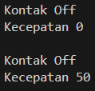

Pada percobaan kali ini, ada beberapa informasi yang masih belum di sembunyikan, contohnya di atribut utama dan atribut internal yang menyebabkan hasil running menjadi sedikit janggal.  Kejanggalannya ada di bagian kecepoatan yang tiba-tiba berubah dari 0 ke 50, sementara kontaknya masih Off.

### 3.2 Percobaan 2 -Access Modifier
Hasil running pada percobaan 2 bisa di lihat di bawah ini:

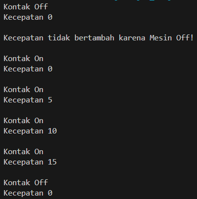

Pada percobaan kali ini, atribut utama (kecepatan dan kontakOn) diubah menjadi private, kemudian ditambahkan method-method lain dangan akses modif public. Sehingga pengguna hanya bisa mengakses method saja tanpa perlu mengutak atik kecepatan ataupun kontakOn.

### 3.3 Pertanyaan
1. Hal ini dikarenakan default value dari kontakOn adalah false, dan hanya akan berubah menjadi true ketika memanggil atau menggunakan method nyalakanMesin().
2. Agar atribut tersebut tidak bisa di akses dan diganti nilainya dengan sembarangan oleh pengguna. Jadi pengguna hanya bisa mengakses atribut tersebut secara tidak langsung lewat method yang telah ada.
3. Pemberian batas kecepatan dilakukan pada fungsi tambahKecepatan yang mulanya

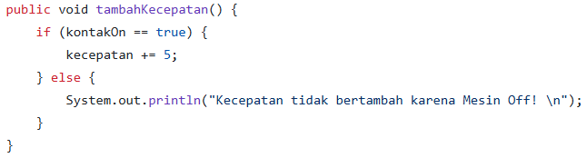

menjadi 

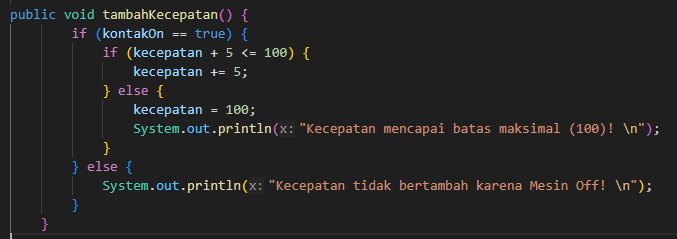

dimana pada mulanya kecepatan tidak memiliki suatu batasan, hanya ada pengkondisian saja, bahwa kecepatan hanya akan bertambah ketika mesin menyala. Namun setelah di ubah, diberikan batasan terhadap maksimal kecepatan atau maksimal tambah kecepatan yaitu kecepatan hanya akan bertambah ketika mesin menyala dan juga nilai dari kecepatan <=100.  jika nilai kecepatan menjadi 100 maka akan muncul warning seperti pada gambar kedua di atas. Dan ketika mesin tidak nyala maka akan ada warning juga.

### 3. 4 Percobaan 3 - Getter dan Setter
Dalam percobaan ketiga, mencoba membuat dan memahami getter dan setter. Dimana dalam percobaan kali ini mengubah simpanan tidak dilakukan dengan mengubah atribut simpanan secara langsung, melainkan melalui method setor.

untuk hasil running dari percobaan ketiga yaitu seperti di bawah ini:

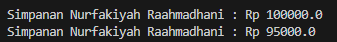

dimana hasil running sama seperti di jobshet, kkecuali nama anggota yang saya ubah menjadi nama saya sendiri.

### 3.5 Percobaan 4 - Konstruktor, Instansiasi
Pada percobaan keempat, menambahkan tampilan saldo awal anggota yang bila di running akan menjadi seperti:

kemudian menambahkan konstruktor berparameter nama dan alamat, serta pada konstruktor tersebut di pastikan bahwa nilai simpanan awal adalah 0.
Kemudian setelah itu, ketika instansiasi harus langsung ditambahkan parameternya. Untuk hasil runningnya seperti di bawah ini:

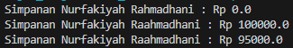

yang dimana karna nama dan alamat sudah ditentukan sejak awal, maka ketika menampilkan banyak saldo sudah ada nama anggota dan juga saldo awal (karena memang belum setor sesuatu) tanpa harus mengetik lebih banyak codingan.

### 3.6 Pertanyaan - Percobaan 3 dan 4
1. Getter adalah public method dan memiliki tipe data return, yang berfungsi untuk mendapatkan nilai dari atribut private.  Sementara setter adalah public method yang tidak memiliki tipe data return, yang berfungsi untuk memanipulasi nilai dari atribut private.
2. Keguanaan method getSimpanan() yaitu untuk menegmbalikan atau menampilkan saldo dari anggota. Jika dijelaskan dengan bahasa teknis maka getSimpanan() akan mereturn nilai simpanan, dimana nilai simpanan tersbeut didapatkan dari method setor dan juga pinjam.
3. setor()
4. Konstruktor yaitu suatu method yang akan di eksekusi pertama kali ketika membuat suatu objek atau menginstasiasi suatu objek. Dimana konstruktor tidak memiliki tipe data return, memiliki nama yang smaa dengan class, dan juga tidak boleh memiliki akses modifier.
5. Aturannya sama seperti yang saya jelaskan pada nomor 4, yaitu nama konstruktor harus sama dengan nama class, kemudian konstruktor tidak memiliki tipe data return, dan juga konstruktor tidak boleh memiliki akses modifier abstract, static, final, dan synchronalized.
6. Boleh, dan tidak akan error. Tetapi tidak disarankan, karena jika menggunakan modifier private maka tidak akan bisa di eksekusi atau di instasiasi di class yang berbeda. Tetapi ada beberapa kasus yang bisa menggunaan modifier private terhadap konstruktor, dan memang diperlukan seperti itu.
7. Ketika ada nilai atau atriut yang memang harus selalu dijalanakan atau di eksekusi sejak dibuatnya objek tersebut/ketika objek tersbeut pertama dijalankan.
8. Perbedaan instansiasi dan Inisialiasi yaitu, jika insialisasi proses pemberian nilai terhadap atribut. Jika instansiasi itu proses pembuatan objek dari kelas.
9. Istilah instansiasi dan inisialisasi method kurang tepat karena method hanya bisa di definisikan atau di deklarasikan.

## 4. KESIMPULAN
Dari percobaan diatas, telah dipelajari konsep dari enkapsulasi, konstruktor, access modifier yang terdiri dari 4 jenis yaitu public protected, default dan private. Konsep atribut dan method class yang ada di dalam blok code class dan konsep instansiasi atribut atau method. Cara penggunaan getter dan setter beserta fungsi dari getter dan setter. Dan juga telah dipelajari atau memahami notasi UML.

## TUGAS
1. Hasil running dari program yang di tuliskan di Tugas yaitu seperti di bawah ini:

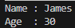

2. Nilai age tetap bernilai 30 meskipun nilai yang di inputkan adalah 35, hal ini dikarenakan pada method setAge terdapat pengkondisian jika age > 30 maka nilai age akan tetap 30. Nah karena 35 > 30, maka nilai yang ditampilkan adalah 30.

3. Batasan nilai minimal usia 18 dan maksimal 30 di ubah pada potongan program yang mulanya:

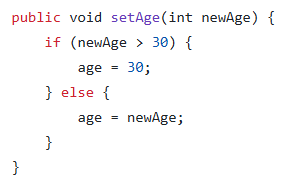

menjadi 

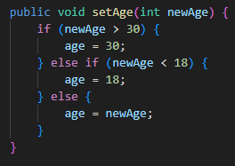

4. Untuk melihat class kontainer bisa di lihat di github, di bagian folder tugas dengan nama class kontainer.java. Dimana disana telah memenuhi semua syarat dari tugas, dengan hasil running di bawah ini:

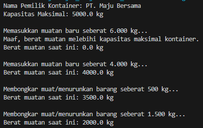

yaitu merupakan hasil yang sama seperti yang di harapkan pada tugas di jobsheet 3.

5. modifikasi program terdapat di 

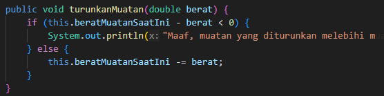

menjadi

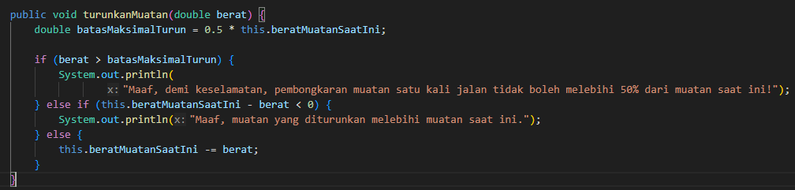

6. 

