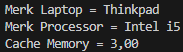
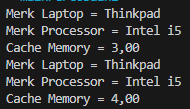
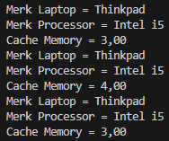
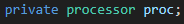
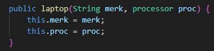
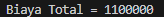

|  | Pemrograman Berbasis Web |
|--|--|
| NIM |  254107020229|
| Nama | Nurfakiyah Rahmadhani |
| Kelas | TI - 2G |
| Repository | https://github.com/borzooraa/PemrogramanBerbasisObjek |

# JOBSHEET 4 # RELASI CLASS: AGGREGATION, COMPOSITION, DAN DEPENDENCY

## Percobaan  1 -  Aggregation Satu-ke-Satu (Laptop dan Processor)
- Checkpoint Langkah 8

pada checkpoint di atas, mendapatkan hasil yang sama seperti pada jobsheet dimana outputannya berisikan merk laptop, merk processor, dan juga chace memory yang merupakan isi dari method l.info (method info di dalam class laptop) yang berisikan proc.info(); + println Nama Laptop.

- Checkpoint Laangkah 9

Pada checkpoint tersebut ditambahi dengan merk laptop dan merk proc yang sama serta chace memory yang berbeda.

Kemudian untuh hasil running setelah langkah kesepuluh adalah sebagai berikut

hasil l2.info() sama persis seperti pada chcekpoint p1_l8

## Pertanyaan Percobaan 1
1. Fungsi dari setter yaitu untuk memberikan nilai kepada beberapa variael, seperti variabel chace, merk(laptop/proc). Kemudian getter yaitu untuk mengambil dan mengembalikan nilai dari variabel yang telah di isi pada method setter.
2. Perbedaan penggunaannya yaitu, kontruktor kosong digunakan ketika kita akan memmbuat objek tanpa harus menginisialisasi atributnya terlebih dahulu, sebaliknya konstruktor berparameter memerlukan inisialisasi terhadap atribut terlebih dahulu.
3.  Atribut yang bertipe object yaitu proc, dapat dilihat pada baris program berikut:

4. Guna dari sintaks tersebut yaitu untuk memanggil method proc.info yang berisikan merk processor dan juga chace memori.
5. Keduanya (langkah 8 dan 10) tidak menghasilkan output yang berbeda, dimana keduanya memiliki outputan yang sama persis karna keduanya sama-sama menginstatnsiasikan objek processor baru dengan nilai parameter yang identik. Yang memebedakan hanyalah sintaksnya saja.
6. Secara kode, relasi antara laptop-processor termasuk agregation, hal ini ditandai dengan pada konstruktor laptop nilai proc di isi melalui paramater, tidak dengan membuat atau menintansiasi object proc secara langsung di konstruktor. Untuk baris kode program yang membuktikan jawaban saya dapat di lihat di bawah ini:

7. Jika memang konstruktor diubah seperti pada jobsheet dimana object proc di intansiasi di dalam konstruktor secara langsung, maka relasi antara laptop-processor tidak lagi agregasi, melainkan relasi compotition. Hal ini dikarenakan jika object laptop hilang maka object proc juga otomatis hilang.

## Percobaan 2 - Aggregation dengan Relasi Ganda (Rental Mobil)
- Checkpoint Langkah 6

